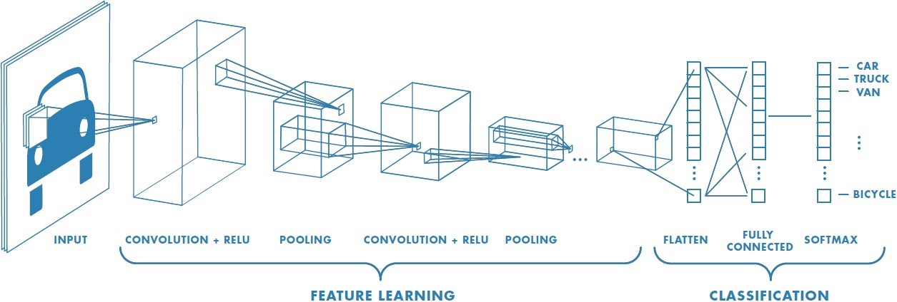

# Experimental PyTorch Convolutional Neural Network (CNN) trained on on CIFAR-10

This is my small experimental CNN using PyTorchs' SimpleCNN and CIFAR-10, all inside a Jupyter Notebook. It is used to test image recognition in 10 classes.

Image data source: https://www.kaggle.com/datasets/fedesoriano/cifar10-python-in-csv

## Setup

Make sure you have: 
- Python 3 (Miniconda)
- Jupyter Notebook

**... and have downloaded the image data (see above), unpacked it, named it `cifar10.csv`and placed it in projects root.**

All necessary packages are installed directly inside the notebook using `pip`, no terminal setup required.\
⚠️ Tip: For faster experimentation, retrain only the best model instead of re-running the full grid search.

## What’s Inside

- Data preprocessing and splitting (`train/val/test`)
- Custom `SimpleCNN` model
- Grid search over N hyperparameters
- Fit and Evaluation metrics for best model

## CNN Architecture

Input (3x32x32)\
 └─ Conv(3→32) + ReLU + MaxPool\
 └─ Conv(32→64) + ReLU + MaxPool\
 └─ Conv(64→128) + ReLU + MaxPool\
 └─ Flatten → FC(1024) + Dropout → FC(10)

Diagram source: https://www.mathworks.com/discovery/convolutional-neural-network.html